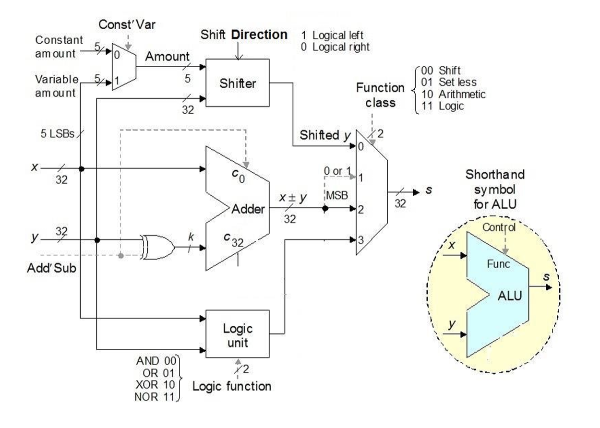

# VerilogALUModule

This was a project for my CPSC 4210 (VLSI Digital Design & Synthesis) class at the University of Lethbridge.

The VerilogALUModule is a comprehensive Arithmetic and Logic Unit (ALU) designed for educational and experimental purposes. It supports a variety of arithmetic and logical operations, making it a versatile component for digital system design projects.

This ALU is capable of performing addition, subtraction, logical shifts (left and right), and arithmetic right shifts, in addition to basic logic operations such as AND, OR, XOR, and NOR. The operation mode of the ALU is determined by control signals that select the function to be performed on the 32-bit inputs.

_Figure referenced from: "Computer Architecture: From Microprocessors to Supercomputers" by Behrooz Parhami._

## Features

- **Arithmetic Operations:** Supports addition and subtraction with overflow detection.
- **Logical Operations:** Capable of performing AND, OR, XOR, and NOR operations.
- **Shift Operations:** Includes logical left shift, logical right shift, and arithmetic right shift functionalities.
- **Set Less Than:** Determines if one input is less than the other, useful for comparison operations.
- **Modular Design:** Composed of smaller, reusable Verilog modules such as adders, shifters, and logic gates, allowing for easy modification and extension.

## Inputs & Outputs

### Control Signals

- `function_class [1:0]`: Determines the operation mode of the ALU.
  - `00`: Shift operations.
  - `01`: Set less than.
  - `10`: Arithmetic operations (addition/subtraction).
  - `11`: Logical operations.
- `add_sub`: Selects between addition (0) and subtraction (1) for arithmetic operations.
- `shift_direction`: Selects the direction of shift operations; left (1) or right (0).
- `logic_function [1:0]`: Selects the type of logical operation.
  - `00`: AND
  - `01`: OR
  - `10`: XOR
  - `11`: NOR

### Data Inputs

- `x [31:0]`, `y [31:0]`: The 32-bit input vectors for operations.
- `constant_amount [4:0]`: Specifies the amount for constant shifts.

### Outputs

- `s [31:0]`: The 32-bit result of the selected operation.
- Overflow and Zero flags (for arithmetic operations and comparisons).

## How It's Made

The VerilogALUModule is structured around smaller, specialized modules that perform specific tasks. These include:

- **Adder/Subtractor Module:** Utilizes a ripple carry adder design for arithmetic operations, with overflow detection.
- **Shifter Module:** Handles logical and arithmetic shifts, adjustable by control signals.
- **Logic Unit:** Performs bitwise logical operations based on selector inputs.

Each of these components is designed to operate independently, allowing them to be tested and verified separately before integration into the ALU.
